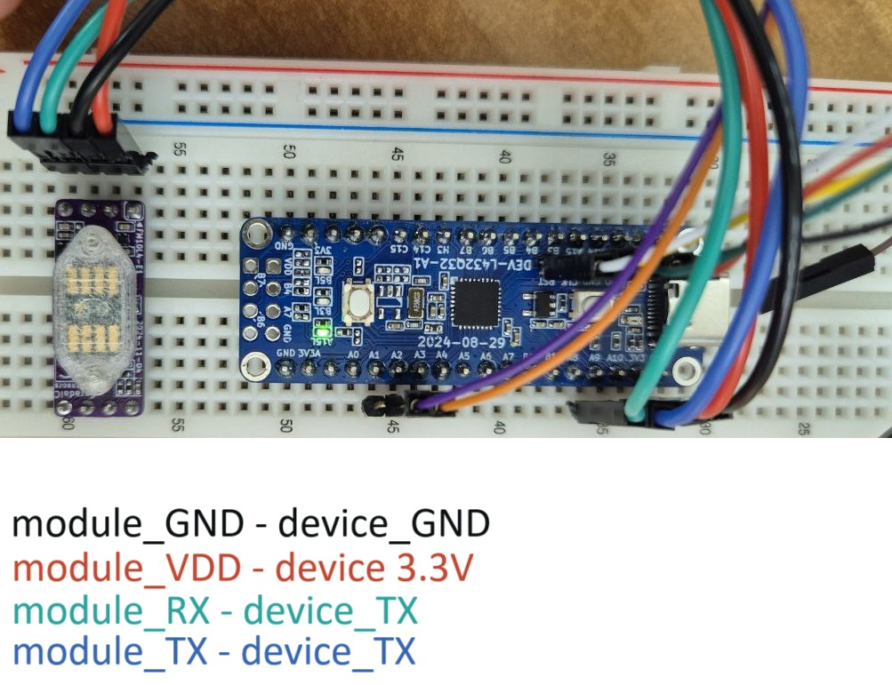

# Faraday-Ox STM32 Example

Example that shows how to interact with Faraday-Ox smart oxygen sensor module (FM25-O2xx) over UART from STM32L432KC MCU master.
Example is developed with STM32CubeIDE.

```Core/Src/main.c``` - contains all the logic
```Core/Inc/registers.h``` - contains FaradaIC defines for the Module 

## NOTE
**In recent versions of modules it is required to connect VDD and VDDA**


